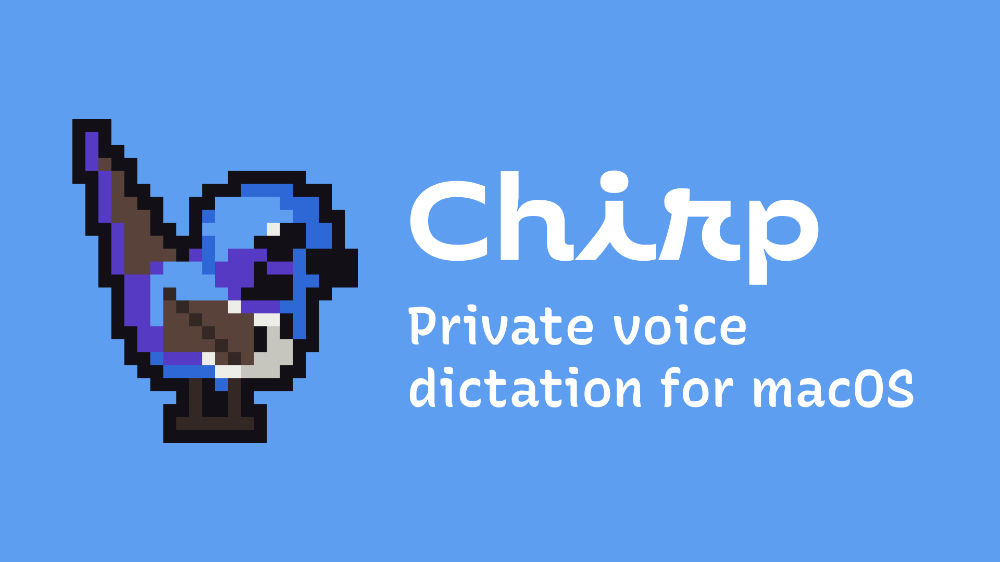
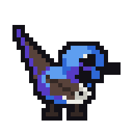

<p align="center">
  
</p>

**Private voice dictation for macOS — everything runs on your Mac.**

Hold your dictation key, speak, release. Clean text appears at your cursor
in any app.
No cloud, no account, no subscription, no word limits.

## Install

No terminal, no Xcode, nothing technical — just these steps:

1. Go to [Releases](https://github.com/jaclyntan/chirp/releases/latest)
   and click **Chirp-\<version\>.dmg** to download it.
2. Open the downloaded file. A window appears with the Chirp icon and a
   shortcut to your Applications folder.
3. Drag the Chirp icon onto the Applications shortcut. That's the install
   — you can close the window now.

**The first time you open Chirp, macOS will get suspicious of it —
that's expected, and there's a one-time trick to get past it:**

Chirp isn't signed with a paid Apple developer certificate (that costs
$99/year, and this is a free hobby project), so macOS treats it the way
it treats any app it doesn't recognise: it refuses to open and may even
say the app is "damaged". It isn't damaged — that warning is generic and
appears for any app from outside the App Store that isn't paid-certified.

To open it anyway, **do this once**:

1. Open your **Applications** folder and find Chirp.
2. **Right-click** (or hold Control and click) on Chirp, then choose
   **Open** from the menu that appears. Don't just double-click it — that
   triggers the warning again.
3. A dialog pops up saying macOS can't verify the developer. Click
   **Open** on that dialog too.

Chirp will now open normally, and every time after this you can just
double-click it like any other app.

*If step 2's menu doesn't offer "Open":* go to **System Settings →
Privacy & Security**, scroll down to the message about Chirp being
blocked, and click **Open Anyway** there instead.

### The first launch

Chirp will ask for two permissions — click **Allow** for both when
prompted:

- **Microphone**, so it can hear you.
- **Accessibility**, so it can notice when you hold the dictation key and
  type your words into whatever app you're using. Without this, Chirp
  still works, but it copies text to your clipboard instead of typing it
  for you, so you'd need to press ⌘V yourself each time.

A short welcome guide walks you through choosing a dictation key and
testing your microphone.

**One thing that surprises people:** Chirp has no icon in the Dock and no
window that stays open — it lives quietly in the menu bar at the top of
your screen. To open its window again later, click its icon in the menu
bar, or click the small animated bird that floats on your desktop.

### Requirements

- A Mac with an Apple Silicon chip (M1, M2, M3, or M4 — any Mac bought
  from late 2020 onward almost certainly has one; check under the Apple
  menu → About This Mac if you're not sure).
- macOS 26 (Tahoe) or newer.

## What it does

- **Push-to-talk** — hold your dictation key anywhere; release to paste at
  your cursor. `fn` (Globe) by default, or pick Right Option, Right Command,
  Right Control, or Right Shift instead. Double-tap for hands-free.
- **On-device recognition** — Apple's SpeechAnalyzer. Instant, no model
  download, works offline.
- **Cleanup** — removes filler words, handles spoken "new line" and "new
  paragraph", capitalises, applies your personal dictionary, and expands
  snippets (say a trigger phrase → paste a saved block). Terminals and
  code editors get your exact words, untouched.
- **Grammar pass** — [Harper](https://github.com/Automattic/harper) catches
  agreement, punctuation and repeated words. Deterministic, milliseconds,
  no model.
- **Learns your corrections** — fix a transcript in History and Chirp
  remembers the misheard word for next time. Ships with starter snippets
  and dictionary entries to edit or clear out wholesale.
- **Paste last transcript** — an optional shortcut that re-pastes your most
  recent transcript at the cursor, for when focus moved mid-dictation.
- **Live transcript**, optionally — see the words appear in the wren's
  speech bubble as you speak.
- **Opens at login**, optionally — so the dictation key works without
  launching anything first.
- **Notetaker** — captures a call from your mic and the meeting app's
  audio, separates speakers, and writes up a transcript locally. Optional
  on-device summary, per note.

## The wren

<p align="center">
  
  
  
  
  
</p>

Chirp's mascot is a splendid fairy-wren — a small, vividly blue Australian
songbird — drawn as 32×32 pixel art on a ten-colour palette, with a
silhouette outline on every frame so it stays legible against any
wallpaper.

It's not just a logo. A floating wren sits on your desktop and reacts to
what the app is doing: alert while listening, head-tilted while working,
preening and tail-flicking when idle. It shows what you just dictated in
a speech bubble you can copy or discard from, so a quick dictation never
needs the main window. Left to its own devices it hops and flies to new
spots on screen — or you can pin it in place from its own toolbar.

## Privacy

Everything runs on this Mac. Recognition is Apple's on-device
SpeechAnalyzer, and every cleanup pass after it — filler removal, your
dictionary, learned corrections, Harper's grammar lint — is deterministic
local code, not a model. The one exception is Notetaker's optional
Summarize, which you trigger yourself and which runs on Apple
Intelligence, still on-device.

Chirp makes no network requests except macOS's own one-time speech-asset
download and a version check against GitHub at launch. The one exception
is opt-in: turning on **Live transcript while speaking** fetches a ~220 MB
streaming model the first time it runs. It's off by default for exactly
that reason. Transcripts live only in
`~/Library/Application Support/Chirp/`.

## Building from source

```bash
git clone https://github.com/jaclyntan/chirp.git
cd chirp
./scripts/make_signing_cert.sh   # once — keeps permissions across rebuilds
./scripts/make_app.sh            # builds build/Chirp.app
open build/Chirp.app
```

Requires full Xcode, not just Command Line Tools — SwiftUI's macros are
Xcode-only compiler plugins. Build, test, architecture and design notes
are in [CLAUDE.md](CLAUDE.md).

## Architecture

Swift Package, SwiftUI + AppKit. Harper is vendored as a prebuilt
xcframework under `Vendor/` with its Rust source included; FluidAudio is a
remote SwiftPM dependency used for voice-activity detection and
Notetaker's speaker separation. See [NOTICE.md](NOTICE.md) for
third-party licences.

```
HotkeyMonitor  →  AudioRecorder  →  Transcriber (Apple SpeechAnalyzer)
                                        ↓
        TextFormatter → LearnedStore → SnippetStore → HarperChecker
                                        ↓
                        TextInserter (clipboard + ⌘V)
```

Recognition engines trialled and removed (WhisperKit, whisper.cpp,
Parakeet) are written up in
[docs/removed-engines.md](docs/removed-engines.md).
[CHANGELOG.md](CHANGELOG.md) covers what changed in each release.

## Credits

Chirp began as a fork of
[Murmur](https://github.com/janisbelozerovs-dev/murmur) and has since
diverged substantially — several recognition engines and features were
removed, and the interface was rebuilt. Murmur is MIT-licensed and its
copyright notice is retained in [LICENSE](LICENSE). Thanks to its authors
for the foundation.

## License

[MIT](LICENSE). Not affiliated with Apple.
